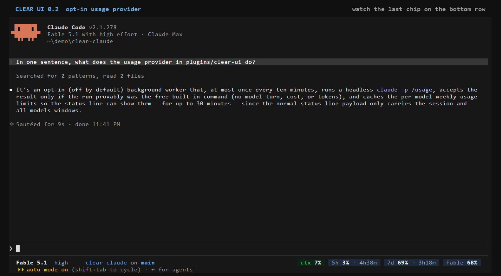
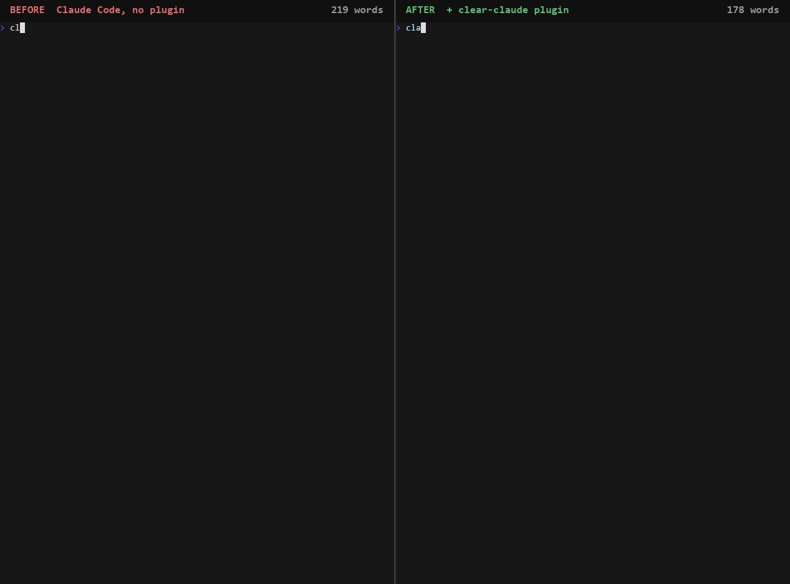

# Clear Claude

[](https://github.com/jessebldr/clear-claude/releases/latest)
[](LICENSE)
[](https://x.com/JesseBldr)

**Make Claude Code easier to understand without making it less capable.**

My Claude Code talked like it was paid per word, and its status line told me nothing. Clear
Claude fixes both, as two small plugins that never touch each other:

- **Clear Partner** — how Claude talks to you. One output style: answer first, plain
  English, concise by default, deep when you ask. Evals show it does not make Claude dumber.
- **Clear UI** — what you can see at a glance. A status bar: model, project and git on the
  left; context, 5-hour and weekly usage on the right.

## Install

The full Clear Claude, identical on Windows, macOS and Linux (Claude Code 2.1.274 or later):

```text
claude plugin marketplace add jessebldr/clear-claude
claude plugin install clear-partner@clear-claude
claude plugin install clear-ui@clear-claude
```

Then start Claude Code and say **`set up clear ui`**. That is the whole setup.

**Want only one?** Run the first line and the line for that plugin. They are independent:
neither installs, needs or changes the other.

- **Partner only** needs nothing else. There is no activation step: the style applies by
  itself from the next session (or after `/reload-plugins`).
- **UI only** needs Node 18 or newer, and the `set up clear ui` step — a plugin cannot
  register a status line, so a script does it, on request.

Inside a session the same commands work as `/plugin marketplace add …` and
`/plugin install …`; run `/reload-plugins` afterwards, before `set up clear ui`, because a
plugin installed mid-session is not loaded yet.

### What changes on your machine

- **Clear Partner: nothing outside the plugin.** No settings edit, no hooks, no files
  elsewhere. While it is enabled its style is the active one; disable it to pick another.
- **Clear UI: one key in `settings.json`**, and only when you ask. Setup prints its plan
  before it writes, backs the file up, edits the `statusLine` key and no other byte, and
  asks before replacing a status line you already have. Its own files (a copy of the
  renderer, backups, a small cache) stay in Claude Code's plugin data folder. By default the
  bar reaches no network and reads no credential.
  [Every path it writes](docs/clear-ui-install.md#what-gets-written-and-where).

### Check, update, remove

- **Check:** say `clear doctor` (Clear Partner) or `clear ui doctor` (Clear UI). Both are
  read-only.
- **Update:** the catalog first, then whichever plugins you have, then restart Claude Code:

  ```text
  claude plugin marketplace update clear-claude
  claude plugin update clear-partner@clear-claude
  claude plugin update clear-ui@clear-claude
  ```

- **Remove Clear UI:** say `remove clear ui` **first** — it puts your previous status line
  back — then `claude plugin uninstall clear-ui@clear-claude`.
- **Remove Clear Partner:** `claude plugin uninstall clear-partner@clear-claude`. It leaves
  nothing behind.

**Installed `clear-claude@clear-claude` before?** That plugin is now called
`clear-partner`. Run `claude plugin marketplace update clear-claude`, then the
`clear-partner` install line above, and restart. Claude Code moves your settings to the new
name by itself. What changes for you, and what was measured:
[docs/migration.md](docs/migration.md).

Scopes, teams, CI flags and recovery: [docs/install.md](docs/install.md) (Clear Partner),
[docs/clear-ui-install.md](docs/clear-ui-install.md) (Clear UI).

---

## See it


*Clear UI in a real session, not a mock-up, cut to 17 seconds: the bar is the bottom row.
Watch the context chip fill in, and the orange dot beside `main` appear when Claude creates a
file and go when it is deleted. In a narrow terminal the same bar
[becomes two rows](assets/clear-ui-narrow.gif). How it was recorded and cut:
[demo/README.md](demo/README.md).*

**Your model's weekly limit on the bar (opt-in, Clear UI 0.2 and later).** Claude Code's
usage screen shows a weekly limit for one model that the status-line data does not carry. Say
`turn on clear ui usage`, or run one command, and it becomes the last chip on the bar:



*Also a recording of a real session, 13 seconds, with the recording account's own numbers.
Off by default, and with it off the bar reaches no network. With it on, a background worker
runs Claude Code's own `claude -p /usage` at most every ten minutes — no model call, no cost,
no credential read by Clear UI — and the chip disappears rather than show a number it cannot
vouch for. What it does, what it costs and what it is careful about:
[plugins/clear-ui/README.md](plugins/clear-ui/README.md#usage-provider-opt-in).*

Clear Partner is recorded side by side with stock Claude Code in the next section.

---

## Why Clear Claude exists

Three failure modes I kept hitting with stock Claude Code. Each one is fixed by a
specific component of Clear Partner — not by vibes, and not by a 400-line CLAUDE.md.

### #1: The agent buries the answer

**The problem.** You ask a direct question, you get three paragraphs of throat-clearing
before the answer shows up — if it shows up. Long responses aren't the problem;
*unstructured* responses are.

**The fix** is [Clear Partner](plugins/clear-partner/output-styles/clear-partner.md):
answer first, plain English, concise by default. The least text that fully
communicates the answer — never the shortest possible answer.




*Real sessions, recorded, not mocked: same question, same model, minutes apart. The only
difference is the plugin, loaded with `--plugin-dir`. It stops when the question is answered.
The waiting is cut out; nothing inside a frame is touched. A third pair,
[disk space](assets/demo-disk-space.gif), is recorded the same way.*

One recording is an anecdote, so the number comes from repeated runs instead: four runs
per arm of three everyday questions averaged **524 → 258 words (−51 %)**, and no plugin
answer was as long as the shortest stock answer to the same question. The raw outputs, the
exact flags, and an earlier take where the plugin's answer came out *longer* are all in
[demo/README.md](demo/README.md).

### #2: "Concise" quietly became "shallow"

**The problem.** Most brevity prompts teach the model to drop things: the warning, the
exact number, the assumption, the tradeoff. You get a shorter answer and a worse one.

**The fix** is a rule Clear Partner states explicitly: *be economical only in what the
user has to read, never in the quality of the work.* Do all the thinking,
investigation, coding, testing, and verification the task requires. Depth is the
default when you ask for it — concision governs the telling, not the doing.

### #3: Nobody can tell if their setup actually works

**The problem.** Claude Code doesn't validate output styles at all. A typo in a
frontmatter field fails silently; a style file that takes the plugin's qualified name
replaces its copy without a word. `claude plugin validate --strict` passes green on a plugin that
installs, enables, and does nothing.

**The fix** is two read-only diagnostic skills that answer with facts, not impressions:

- `/clear-partner:clear-doctor` — is it installed correctly? Prints a PASS/WARN/FAIL
  table: install state, manifest validity, style frontmatter, settings-layer
  precedence, version match, conflicting styles. Never prints your settings contents.
- `/clear-partner:clear-audit` — is it *actually working*? Walks Claude Code's own
  style-resolution rules to confirm Clear Partner is the active style, and compares
  the style file's SHA-256 against the recorded value so you know the prompt is
  unmodified.

---

## What's inside

**Clear Partner** (`clear-partner`) — the communication layer:

| Component | Type | What it does |
| --- | --- | --- |
| Clear Partner | Output style | Answer-first, concise-by-default communication. Auto-activates on install. |
| `clear-doctor` | Skill (model-invoked) | Diagnoses the install end to end, prints PASS/WARN/FAIL with remediation. |
| `clear-audit` | Skill (model-invoked) | Verifies the style is active and the file is unmodified. No tone grading. |

This plugin is deliberately tiny: one text file, one manifest, two skills. No hooks, no
MCP servers, no CLAUDE.md, no personality injected through three layers at once.

**Clear UI** (`clear-ui`) — the status layer:

| Component | Type | What it does |
| --- | --- | --- |
| Status bar | Node script, zero dependencies | Draws only from the JSON Claude Code already pipes to a status line, plus one cached `git status`. By default: no network, no credentials, no transcript parsing. |
| Usage provider | Opt-in, off by default | Shows the weekly limit scoped to one model, which the status-line data does not carry. Runs Claude Code's own `claude -p /usage` in the background, at most every ten minutes, and reads its structured output. Claude Code reaches the network for that with its own sign-in; Clear UI reads no credential, calls no API, and the run makes no model call. |
| `clear-ui-setup` | Skill over a deterministic script | Plans, backs up, edits one settings key, restores on uninstall. |
| `clear-ui-configure` | Skill over a deterministic script | Presets, single segments, looks. |
| `clear-ui-doctor` | Skill over a deterministic script | Read-only: why is it not showing? |
| Hooks | Documented classic hooks | `SessionStart` re-copies the renderer after a plugin update. The `PostToolUse`, `PostToolUseFailure` and `Stop` hooks behind verification state and the activity row exit at once and record nothing until you opt in. |

Clear UI is code, so unlike Clear Partner it has hooks and a test suite; it injects no
prompt and makes no model call. Details: [plugins/clear-ui/README.md](plugins/clear-ui/README.md).

> Use prompts for judgment. Use deterministic mechanisms for mechanics.

Communication style is a judgment concern, so it lives in exactly one prompt layer —
the output style — and nowhere else. A status bar is mechanics, so it is a script. Each
layer is its own plugin ([ADR 0004](docs/adr/0004-one-plugin-per-layer.md)). The full
reasoning is in [docs/philosophy.md](docs/philosophy.md), and the key decisions are
recorded as [ADRs](docs/adr/).

---

## Evals: what we claim, and what we don't

Six behavioural cases, each run with the plugin **on** and **off** (`claude plugin
eval`, judge: Haiku):

| Case | With style | Without |
| --- | --- | --- |
| correctness-preserved | ✓ 1.0 | ✓ 1.0 |
| concise-by-default | ✓ 1.0 | ✓ 1.0 |
| depth-when-asked | ✓ 1.0 | ✓ 1.0 |
| no-style-leak | ✓ 1.0 | ✓ 1.0 |
| workflow-multi-step | ✓ 1.0 | ✓ 1.0 |
| ambiguous-request | ✓ 1.0 | ✓ 1.0 |

**6/6 both ways. $1.84 total. Delta: zero.** (Claude Code 2.1.274.)

Re-run on Claude Code 2.1.278, same prompt, $1.54: **6/6 with the style again.** The
baseline arm went 5/6 — on the ambiguous request it ran out of turns working instead of
asking, so there was nothing to grade. That is one errored run, not proof the style is
better, and it is recorded that way.

Six more cases, g–l, pin what the demo recordings exposed: when you fix the shape of the
reply — "one sentence", "just the command", "nothing else" — that outranks the style's own
habits, except for one short safety-critical warning. On 0.1.0 "in one sentence" after tool
use came back as two or three sentences, 4 runs in 4; 0.1.1 passes 4 in 4, and the original
six still pass 6/6. The prompt was edited only where a case failed first.

The claim was never "this makes Claude smarter." It's "it doesn't make it dumber."
One run per case is smoke-test evidence, not a benchmark — the suite, the raw
results, and the honest limits are in [docs/evals.md](docs/evals.md).

---

## Roadmap

- [ ] Submit to the official Claude Code marketplace so install is one command
- [x] Re-run evals against a new Claude Code version: 6/6 again on 2.1.278. Repeat per
  release; the suite is cheap (~$2)
- [ ] `clear-doctor` auto-fix mode (currently read-only by design)
- [x] Clear UI: a status bar as a second plugin (`clear-ui`)
- [x] One name per layer: the plugin `clear-claude` became `clear-partner`, with automatic
  migration for existing installs ([ADR 0005](docs/adr/0005-naming-and-install-paths.md))
- [x] Clear UI: CI green on Linux, macOS and Windows; its opt-in features (verification
  state, activity row) exercised end to end against real hook payloads on Windows
  ([what that showed](docs/clear-ui-dogfood.md))
- [ ] Clear UI: the same run on a real Mac, which also settles the macOS timing budget
  ([checklist](docs/clear-ui-dogfood.md#checklist-for-a-mac))
- [ ] Clear Transcript, the third layer: Anthropic is shipping function hooks ("Claude Mods",
  [anthropics/claude-code#91870](https://github.com/anthropics/claude-code/issues/91870)).
  When the API is documented and on by default, build the transcript renderer as a
  real mod. `verification-state` no longer waits for it — it shipped inside Clear UI on
  documented classic hooks. Clear Partner itself will never depend on mods.

The phase-by-phase plan is [docs/roadmap-v2.md](docs/roadmap-v2.md).

---

## Docs

Names, once: **Clear Claude** is the product and the marketplace (`clear-claude`).
**Clear Partner** (`clear-partner`) and **Clear UI** (`clear-ui`) are its plugins, so an
install id reads *layer@product*. Why: [ADR 0005](docs/adr/0005-naming-and-install-paths.md).

Using it:

- [docs/install.md](docs/install.md) — Clear Partner's full lifecycle: scopes, teams, CI
  flags, verify, disable, uninstall, recovery
- [docs/clear-ui-install.md](docs/clear-ui-install.md) — Clear UI: setup, what gets written
  and where, configure, optional features, uninstall
- [docs/migration.md](docs/migration.md) — coming from the plugin's former name
- [docs/troubleshooting.md](docs/troubleshooting.md) — symptom-first fixes for Clear
  Partner, including the silent failures no validation catches
- [CHANGELOG.md](CHANGELOG.md) — what each release changes for you

The proof:

- [docs/evals.md](docs/evals.md) — the behavioural eval suite, what it proves and what it
  does not
- [demo/README.md](demo/README.md) — how every animated image here was recorded from real
  sessions, what is controlled, the repeated-run numbers and the raw outputs
- [docs/clear-ui-dogfood.md](docs/clear-ui-dogfood.md) — Clear UI's first end-to-end run
  with real hook payloads, and the same run as a checklist for a Mac
- [docs/research/](docs/research/) — platform behaviour as measured, each file tagged with
  the Claude Code version it was verified on: the plugin system
  ([phase 0](docs/research/phase0-research.md)), an
  [isolated marketplace install](docs/research/marketplace-test.md), the status line
  ([UI research](docs/research/ui-research.md),
  [UX distillation](docs/research/ux-distillation.md)),
  [headless `/usage`](docs/research/headless-usage.md) and
  [function hooks](docs/research/mods-research-2.1.277.md)

How it is built, and why:

- [docs/philosophy.md](docs/philosophy.md) — why answer-first, what "concise" means here,
  prompts for judgment vs mechanisms for mechanics
- [docs/architecture.md](docs/architecture.md) — the repository and Clear Partner: design
  decisions and the `force-for-plugin` tradeoff
- [docs/ui-architecture.md](docs/ui-architecture.md) — Clear UI: every design decision,
  with the measurement behind it
- [plugins/clear-ui/README.md](plugins/clear-ui/README.md) — Clear UI's scripts, looks,
  file layout and tests
- [docs/adr/](docs/adr/) — architecture decision records
- [docs/clear-partner-port.md](docs/clear-partner-port.md) — exactly how the shipped style
  differs from the original (one line), and its recorded SHA-256
- [docs/roadmap-v2.md](docs/roadmap-v2.md) — phases, what was built differently from plan,
  what is still unverified

Working on it:

- [AGENTS.md](AGENTS.md) — the repository's rules for coding agents and contributors:
  layout, commands, invariants, where each fact lives
- [docs/releasing.md](docs/releasing.md) — how to cut a release; a prompt edit is a
  version bump

## License

MIT — see [LICENSE](LICENSE).
