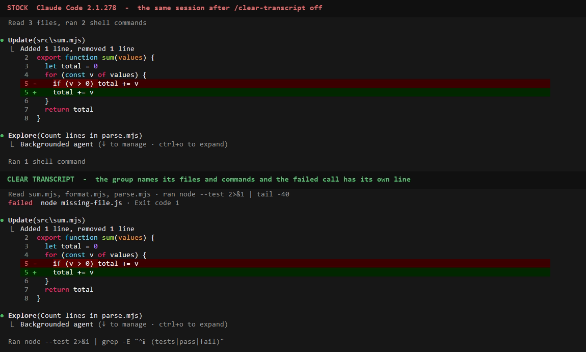
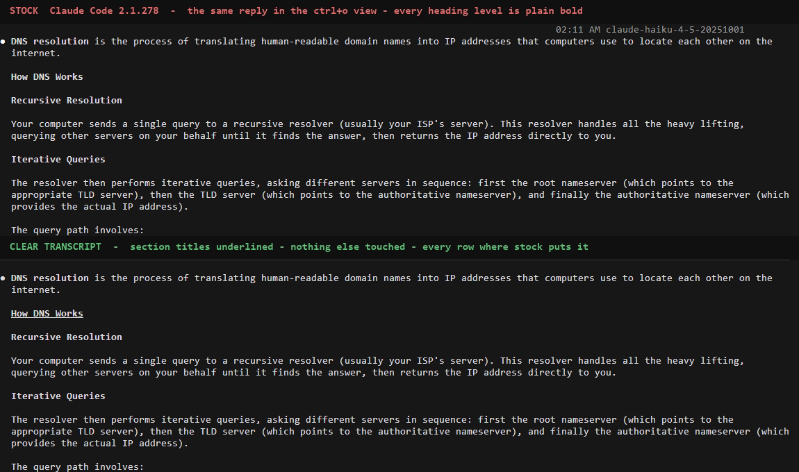

# Clear Transcript dogfood: real sessions, real replies

Clear Transcript's tests can show what tree a hook returns and that the engine accepts it. They
cannot show paint: wrapping, rows, colour as drawn, what ctrl+o really does. This page records the
sessions that did, on Windows, and what they changed in the design. Design:
[clear-transcript.md](clear-transcript.md).

## Windows 11 — 2026-09-20 — pass, with four things worth knowing

Claude Code 2.1.278, Git for Windows, `clear-transcript` 0.1.0 from the working tree, loaded with
`--plugin-dir` and the gate set for that one command. Every session was a real interactive Claude
Code, typed into and recorded by VHS; the model calls were real (Haiku 4.5 for answers, Sonnet 5
for the working session). Two layouts: fullscreen, which this machine gets by default, and the
main screen (`CLAUDE_CODE_NO_FLICKER=0`). Two widths: 142 and 72 columns.

The two stills below are each **one session shown twice** — the same transcript as Claude Code
draws it and as Clear Transcript draws it — made by
[demo/clear-transcript-stills.mjs](../demo/clear-transcript-stills.mjs) from
[demo/clear-transcript-work.tape](../demo/clear-transcript-work.tape) and
[demo/clear-transcript-answer.tape](../demo/clear-transcript-answer.tape). Crops of recorded
frames; nothing inside a pane is drawn.





| Asked of it | What happened |
| --- | --- |
| A simple factual answer | No section title, so the hook returned `next(e)`: the reply is Claude Code's own drawing, and sits under a Clear Transcript reply with the same bullet, gutter and spacing. |
| A long structured answer | `##` titles underlined; `###` sub-headings, list, table and code block are the engine's. |
| A code-heavy answer; lists and tables | Untouched by design. The fence and its highlighting, the bordered table and the hanging list indents are the engine's `Markdown` leaf. |
| Debugging with several tool calls | `Read sum.mjs, format.mjs, parse.mjs · ran node --test 2>&1 \| tail -40`, where stock draws `Read 3 files, ran 2 shell commands`. |
| A tool failure | `failed  node missing-file.js · Exit code 1` on its own line, `failed` in the theme's error colour. Stock, fullscreen: nothing on screen. |
| Implementation with an edit and verification | The edit's diff is the engine's, untouched. The verifying run reads `Ran node --test 2>&1 \| grep -E "^ℹ (tests\|pass\|fail)"` instead of `Ran 1 shell command`. |
| Sub-agent activity | `Explore(…)`, `Backgrounded agent` and the `Agent "…" finished` notice are the engine's. |
| A narrow terminal (72 columns) | Answers only: titles, wrapping and hanging indents hold, and the engine's stacked-table fallback is inherited. The group line was not recorded narrow; that names give way to `+N more` and the line fits the row from 60 columns is held by unit tests. |
| A streaming response | Nothing to see, with or without the plugin: see the first point below. |
| Expand and recover the original | ctrl+o: every row is the engine's, then Clear Transcript's again after Esc. `/clear-transcript off`: every row on screen is redrawn by the engine at once; `on` brings the drawing back. |
| The main-screen layout | Same behaviour. Stock there draws each shell command as its own row with an output preview, failures in red, so only the folded read line changes. |

**Four things worth knowing:**

1. **No reply streamed onto the screen, with or without a plugin.** In every recording, and in
   control sessions with no plugin and no gate in both layouts, the screen shows the spinner and its
   token count until the block is complete, then the whole reply in one frame. Claude Code's own
   notes describe a live text preview, so this is probably the recording environment. It matters
   because a mod's tree takes over a reply's row only when the block completes: if the tree were a
   different height from the preview, text would move under the reader at that moment. It could not
   be shown here that it would not, so the design was changed to make the question moot — point 2.
2. **An answer is exactly as tall as stock draws it.** The first design pulled a sub-heading onto
   the paragraph under it, which read better and made a reply shorter. It was withdrawn for the
   reason above. Measured on one reply in one session: from its first line to the `✻ Cogitated`
   line is 714 px (42 rows) in Clear Transcript's view and 714 px in the ctrl+o view, which is the
   engine's drawing, and every line between them sits at the same offset.
3. **A failure the engine does not flag is not flagged.** Asked to run `node --test`, the model
   ran `node --test 2>&1 | tail -40`. The pipe's exit status is `tail`'s, so the call was not marked
   as errored and no `failed` line was drawn, although one test failed. In an earlier take of the
   same prompt the model ran the commands bare, and both failures got their lines. Clear Transcript
   shows what the engine knows and guesses nothing — but because the line now carries the command
   and not a count, the pipe is there to be read. (Clear UI met the same habit from the other side:
   [clear-ui-dogfood.md](clear-ui-dogfood.md).)
4. **A long command first took the row from its neighbour.** The first take with the committed
   tape drew `… · ran node --test 2>&1 | tail -40 +1 more` on a 142-column row with sixty cells
   free: the row was shared equally between the kinds of call, however little the first one
   needed. It is now given out in order, each kind keeping a minimum, and the second command is
   named. Found by looking at a recording; no test had asked.

**Not seen:** macOS or Linux; a live resize (VHS cannot); `--resume`; a light theme; a screen
reader; another render mod in the chain; a group the model did not batch the way it did here.

## How the design variants were compared

Heading treatments were drawn in a real terminal from recorded replies
([test/fixtures/replies](../experimental/clear-transcript/test/fixtures/replies), ten real
`claude -p` answers, with and without Clear Partner) by a throwaway plugin whose slash command
printed a fixture through the same plan code — no model call, one session per variant, at 142 and
72 columns. Six were drawn: stock; a weight ladder with no colour; accent sections in the theme's
`suggestion` and in `professionalBlue`; dim `##` markers kept, with and without colour; underline
only. What was chosen and why: [clear-transcript.md](clear-transcript.md#decisions-and-the-variants-behind-them).
The throwaway plugin is not in the repository; its one idea — hook `CommandOutput` for your own
command and draw its `text` — is enough to rebuild it.

## The same run, as a checklist

```sh
# once: open ~/demo/sum-bug by hand and accept the workspace-trust dialog
CT_REPO="$PWD" bash demo/record.sh clear-transcript-answer
CT_REPO="$PWD" bash demo/record.sh clear-transcript-work
node demo/clear-transcript-stills.mjs     # after checking the frame numbers against the new frames
```

Look for: section titles underlined and nothing else different in an answer; the same height in
the normal and the ctrl+o view; names in every settled group line; a `failed` line for a command
that failed bare; every row stock again under ctrl+o and after `/clear-transcript off`; no
`hook was skipped` or `does not validate` line anywhere in the session.
